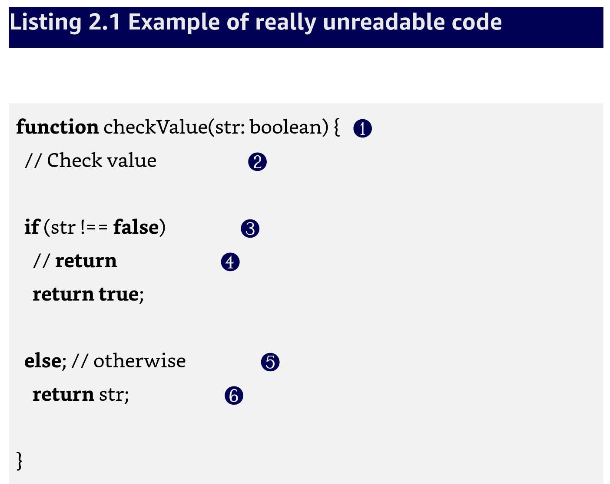
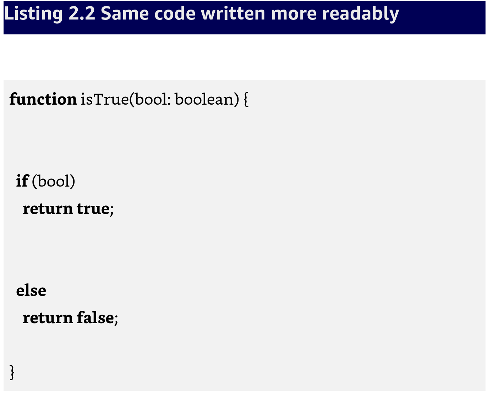
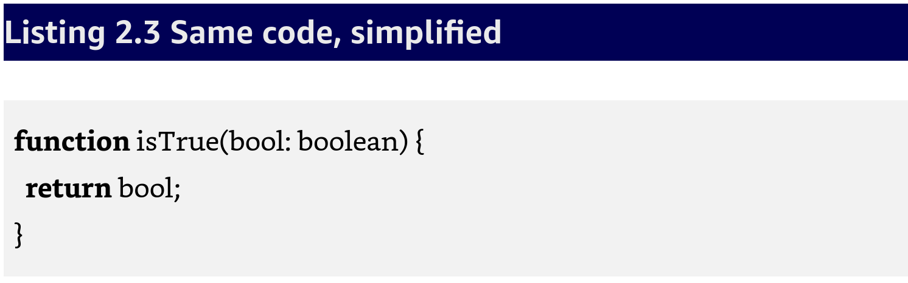
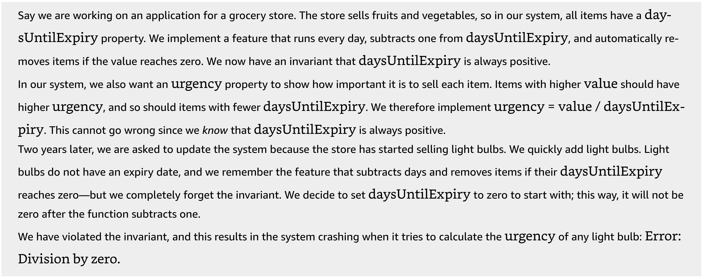
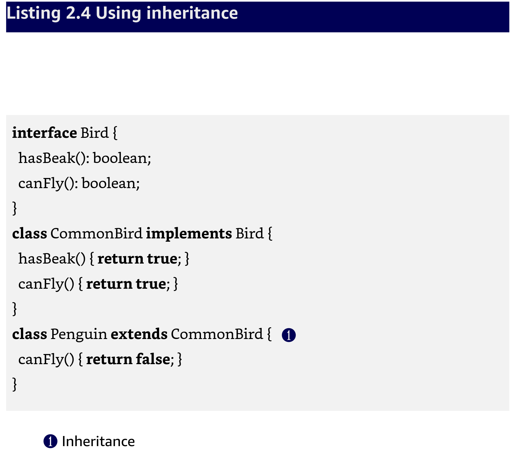
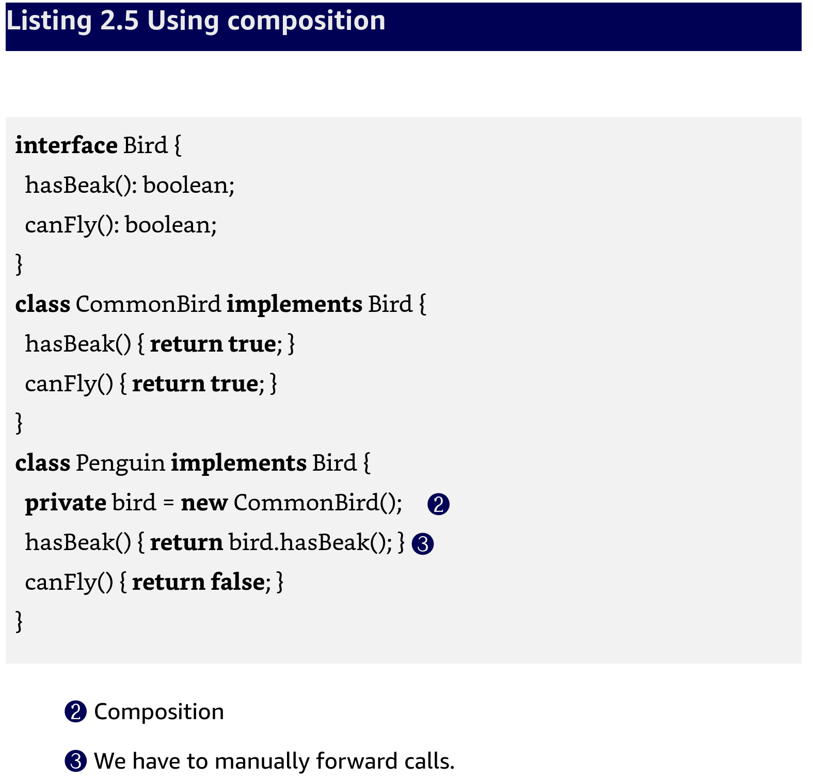
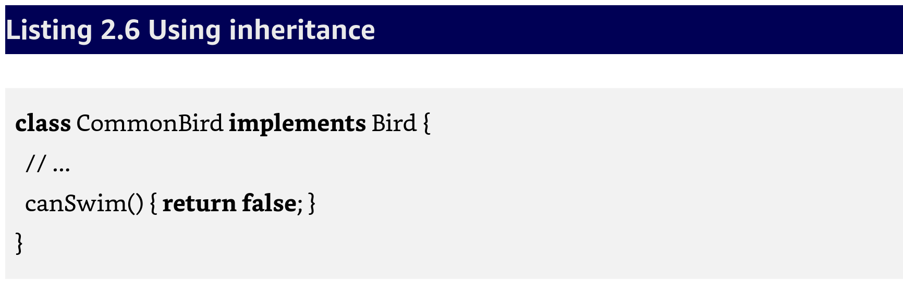

# Chapter Two - Discussion

**This capter covers**

* Readability to communicate intent
* Localizing invariants to improve maintainability
* Enabling change by addition to speed up development
* Making refactoring part of daily work

- [ ] Ask: What is our definition of refactoring?

```text
Refactoring -- Changing code to make it more human readable and maintainable without changing what it does
```

## 2.1 Improving readability and maintainability

* Make code better without changing what it does.

## 2.1.1 Making code better

- [x] Question: What do we mean by "readability"
- [x] Answer: Readability is the code's aptitude for communicating its intent





- [x] Question: what makes the changed code more readable?
- [x] Answer:

1. fixes bad param name
2. remove unhelpful comment
3. double negation is hard to read
4. remove comment that just repeats code
5. easy-to-miss semicolon (;) and a trivial comment
5. misleading indentation; and at this point str can only be false; at this point str can only be false.

Now that the code has been cleaned up we can now see how to simplify it even more!



**MAINTAINABILITY**

- [x] Question: What does maintainability mean to you?

Maintainability is an expression of how much we need to investigate to safely, quickly, and easily modify the the code to accommodate our new goal.

Maintainability is closely tied to the risk that is inherent any time we make a change.

Long investigation times is a symptom that code maintainability is bad.

If you have ever experienced fixing something here and breaking something over there then you have a fragile system.

Root of fragility is global state.  Global here means outside the scope we are considering.  From the perspective of a method, class fields are global.  State is anything that can change while the program is running.

A useful trick to help think about global state is to look for braces: {...}.  Everything outside the braces is considered global state for everything inside the braces.

- [x] Question: What is the problem with global state?
- [x] Answer: When data is global, it can be accessed or modified by someone who associates different properties with it, thereby inadvertently breaking our properties.  Properties that we do not explicitly check in the code are called **invariants**.

- [x] Question: What is an invariant?
- [x] Answer:  Examples: "This number will never be negative" or "This file definitely exists".

- [x] ASK: Who would like to summarize the example of how nonlocal invariants corrupt example below?  Page 15



Refactoring tends to improve maintainability by moving the invariants closer together so they are easier to see.  This is called localizing invariants: things that change together should be together.

## 2.1.2 Maintaining code ... without changing what it does

- [ ] Ask: Someone to summarize this section.

* If we input a value we expect the same result before and after refactoring -- even if the result is an exception
* Performance may take a slight hit.  Remember we favor maintainability over performance.  If performance is important it should be handled in a separate phase from refactoring, guided by profiling tools and with performance experts.
* Be mindful of how much code is being refactored.  The less code we reserve for refactoring, the lower the risk of change conflicts.

To sum up:

1. Improving readability by communicating intent
2. Improving maintainability by localizing invariants
3. Doing 1 & 2 without affecting any code outside our scope.

## 2.2 Gaining speed, flexibility, and stability

- [x] Ask: Who would like to give us a summary of this section?

* Cleaner codebase means we are: more productive, make fewer mistakes, and it is more fun!

## **Next Week** 2.2.1 Favor composition over inheritance

- [ ] Ask: Who would like to tell us what he means by composition over inheritance?

* Gang of Four recognized this in their book "Design Patterns"





Now imagine having to a new method to Bird called canSwim.  In both cases, we add this method to CommonBird.



**FLEXIBILITY**

A system build around composition allows us to combine and reuse code in a much more fine-grained manner than we could otherwise.  Think of it like working with LEGO blocks.

## 2.2.2 Changing code by addition rather than modification

- [x] Ask: What does he mean by changing code by addition rather than modification?

* Composition allows for **change by addition**.  This means we can add or change functionality without affecting other existing functionality.
* Often referred to as the open-closed principal.

**PROGRAMMING SPEED**

* Ability to make our changes without touching any of the other code, saves time!
* Delete unused code as quickly as possible!

**STABILITY**

* When we follow a change-by-addition mindset, it is always possible to preserve the existing code.
* Can always fallback to old functionality if the new code fails.

## 2.3 Refactoring and your daily work

* Refactoring should be part of any programmer's daily routine
* Borrowing time from the next programmer when delivering unrefactored code.
* We call this Tech Debt

Recommended approaches:

1. In a legacy system, start by refactoring before making any changes.  Then follow the regular workflow.
2. After making any changes to the code, refactor.

```text
Always leave a place better than you found it
```

--- The Scout rule

## 2.3.1 Refactoring as method of learning

* side effect of code refactoring - increase deployment frequency.
* with flexibility, it is possible to build configuration management or feature toggling systems, the maintenance of which would be infeasible without the flexibility.

Refactoring allows us to improve code even without understanding it.  This way, we can digest small portions while we are working on the code until the final result is very easy to understand.

## 2.4 Defining the "domain" in a software context

* Our domain is 2D puzzle game
* Users are players
* domain experts are the game or level designers.

When developing software we work close with domain experts, which means we must learn their language and culture.

## Summary (Page 20)

- [ ] Ask: What did we learn in this chapter?