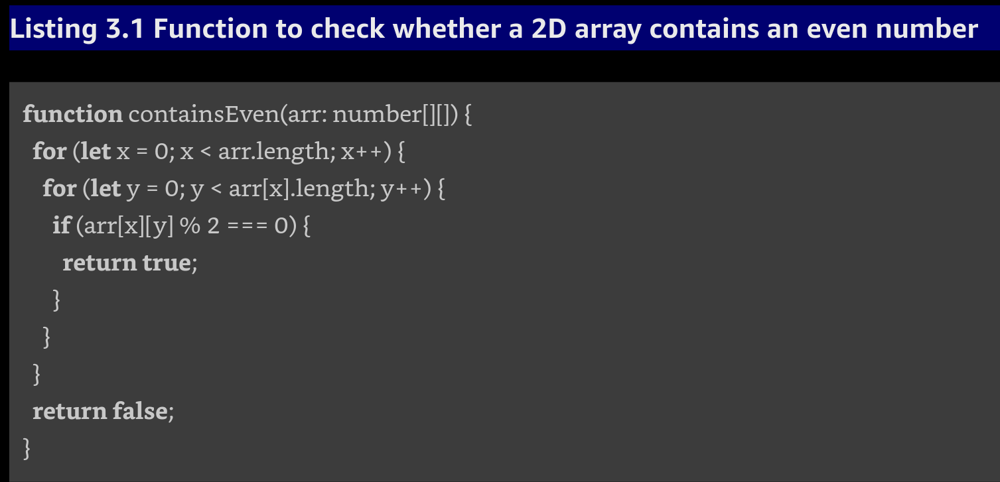
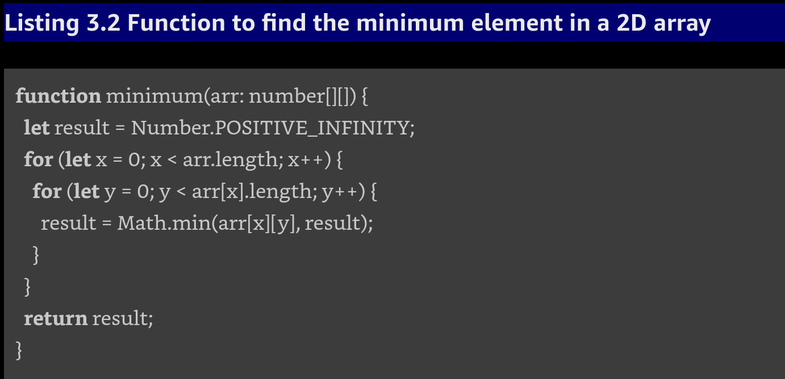

- [Chapter 3 - Shatter long functions](#chapter-3---shatter-long-functions)
	- [3.1 Establishing our first rule: Why five lines?](#31-establishing-our-first-rule-why-five-lines)
		- [3.1.1 RULE: Five lines](#311-rule-five-lines)
			- [EXPLANATION](#explanation)
			- [SMELL](#smell)
			- [INTENT](#intent)
			- [References](#references)
	- [3.2 Introducing a refactoring pattern to break up functions](#32-introducing-a-refactoring-pattern-to-break-up-functions)
			- [NOTE](#note)
		- [3.2.1 Refactoring Pattern: Extact Method](#321-refactoring-pattern-extact-method)
			- [DESCRIPTION](#description)
			- [PROCESS](#process)
			- [EXAMPLE](#example)
			- [FURTHER READING](#further-reading)
	- [3.3 Breaking up functions to balancing abstraction](#33-breaking-up-functions-to-balancing-abstraction)
		- [3.3.1 RULE: Either call or Pass](#331-rule-either-call-or-pass)
			- [STATEMENT](#statement)
			- [EXPLANATION](#explanation-1)
			- [SMELL](#smell-1)
			- [INTENT](#intent-1)
			- [REFERENCES](#references-1)
		- [3.3.2 Applying the rule](#332-applying-the-rule)
	- [3.4 Properties of a good function name](#34-properties-of-a-good-function-name)
	- [3.5 Breaking up functions that are doing too much](#35-breaking-up-functions-that-are-doing-too-much)
		- [3.5.1 RULE: If only at the start](#351-rule-if-only-at-the-start)
			- [Statement](#statement-1)
			- [Explanation](#explanation-2)
			- [SMELL](#smell-2)
			- [INTENT](#intent-2)
			- [REFERENCES](#references-2)
		- [3.5.2 Applying the rule](#352-applying-the-rule)
	- [SUMMARY](#summary)

# Chapter 3 - Shatter long functions

-[ ] What contributes to "messy" code?

* Methods are doing more than one thing
* We use low-level primitives operations
* Lack of human readable text

We will first tackle 2 large methods Draw and Update.  Using the **Extract Method**.

## 3.1 Establishing our first rule: Why five lines?

Introduction of the fundamental rule in this book.  Five lines of code is the ultimate goal, adhering to this rule alone is a huge inprovement all on its own.

### 3.1.1 RULE: Five lines

No method should have more than five lines of code.

#### EXPLANATION

A line refers to an if, for, while, or anything ending with a semicolon.  We do not count whitespace and braces.

Specific limit of "5" is less important than having a limit.  A good way to determine this value is to do a pass through of the applications fundamental datastructure.  In our case with the 2D game the fundamental data structure is a 2D array.





#### SMELL

Having long methods is a smell.  Too much to keep up with.  So what is long?

- [ ] ASK: What constitutes a long method?

To help answer this question we can reference another smell, methods should do one thing.  Five lines of code is exactly what is necessary to do one meaningful thing, then this limit also prevents us from breaking that smell.

#### INTENT

Smaller methods are preferred because the naming of the method provides an opportunity to communicate intent.  Method naming is equivalent to putting a comment at least every 5 lines.

#### References

Methods do one thing in Robert C. Martin's book Clean Code
Long Methods in Martin Fowler's book Refactoring

## 3.2 Introducing a refactoring pattern to break up functions

Begin by looking at the shape of the code.  We are trying to identify groups of lines releated to the same thing.  To make the groups clear we add blank lines where we think the group should be.  We can even add comments (temporarily) to help group code.

We are not trying to understand what the function is doing.  The method is too large and too time consuming at this point.

- [ ] Review function:  Ask what does the structure of Draw imply?  What methods could we create to help break Draw into smaller parts.

1. Create a new method, drawMap
2. Where the comment is put a call to drawMap
3. Move lines of code relavent to the comment drawMap to the method drawMap

Rinse and Repeat for drawPlayer comment

Congradulations we have completed our first two refactorings!  The process we just went through is a standard pattern that we call Extract method.

#### NOTE

Because we only moved code around, the risk of introducing errors is minimal, especially since the compiler told us when we forgot parameters.

### 3.2.1 Refactoring Pattern: Extact Method

#### DESCRIPTION

Extract method take part of one method and extracts it into its own method.  This can be done manually or by using a more modern IDE this refactoring patter is built in.

#### PROCESS

- [x] Show example: Undo previous changes and use VS Code to help extract methods

#### EXAMPLE

**skip** go to page 14 Further Reading

#### FURTHER READING

To learn about other techiques in refactor methods please refer to Martin Fowler's book, Refactoring.

## 3.3 Breaking up functions to balancing abstraction

Draw conflicts with another rule now...

### 3.3.1 RULE: Either call or Pass

#### STATEMENT

A function should either call methods on an object or pass the object as an argument, but not both.

#### EXPLANATION

Levels of abstraction:

* low-level operations are performed on objects like "obj.doTheThing();" or "arry[0].theThing = 'thing'".
* high-level operations are when you pass an object as a param to another function.

We should not mix levels of abstraction within a method.

**Before**

```ts
function average(arr: number[]) {
  return sum(arr) / arr.length;
}
```

**After**

```ts
function average(arr: number[]) {
  return sum(arr) / size(arr);
}
```

#### SMELL

The statement "The content of a function should be on the same level of abstraction" is so powerful that it is a smell in its own right.

#### INTENT

This rule forces us to also extract other details.  This way, we make sure the level of abstraction inside the method always stays the same.

#### REFERENCES

You can read more about the smell "The content of a function should be on the same level of abstraction" in Robert C. Martin's book Clean Code.

### 3.3.2 Applying the rule

Back to draw method.

- [x] Ask:  Who would like to tell us why draw is in violation of rule `Either call or Pass`?

## 3.4 Properties of a good function name

What is a good name for the new method?

What makes a good method name?

- [x] Ask:  What makes a good method name?

* describe functions intent
* it should be complete
* it should capture everyting the function does
* it should be understandable for someone working in the domain.

- [x] Ask: after code refactoring of draw, why does this now adhere to the rule "Either call or Pass"?

- [x] Refactor Update Method

## 3.5 Breaking up functions that are doing too much

Taking a look at the new functions we created we notice that `updateMap` is now in violation of rule `If only at the start`.

### 3.5.1 RULE: If only at the start

#### Statement

If you have an if, it should be the first thing in the function.

#### Explanation

You guessed it, if should be the first thing in the function.  It should also be the only thing, in the sense that we should not do anyting after it; but we can avoid having something after it by extracting that separately, as we have seen multple times.

We should not extract the body of an `if` and we should not separate it from its `else`.  Both the body and the `else` are part of the code structure, and we rely on this structure to guide our efforts so we do not have to understand the code.  Behavior and structure are closely tied, and as we are refactoring, we are not supposed to change the behavior -- so we shouldn't change the structure, either.


We have two clear responsibilities:

1. Loop over the numbers
2. Check whether a number is prime

**Before**

```ts
function reportPrimes(n: number) {
  for (let i = 2; i < n; i++)
    if (isPrime(i))
      console.log(`${i} is prime`);
}
```

**After**

```ts
function reportPrimes(n: number) {
  for (let i = 2; i < n; i++)
    reportIfPrime(i);
}

function reportIfPrime(n: number) {
  if (isPrime(n))
    console.log(`${n} is prime`);
}
```

Everytime we check something, it is a responsibility, and it should be handled by one function.  Therefore we have this rule!

#### SMELL

This rule --like Five lines -- Exists to help prevent the smell of functions doing too much.

#### INTENT

This rule intends to isolate the `if` statements because they have a single responsiblity, and a chain of else ifs represents an atomic unit that we can split up.  This means the fewest lines we can achieve with extract method in the context of an if with elseifs is to extract exactly on the that if along with its else ifs.

#### REFERENCES

Methods should do only one thing - Robert C. Martin - Clean Code

### 3.5.2 Applying the rule

- [ ] Group Exersice - Fix updateMap()

## SUMMARY

Introduced rule Five lines of code
Introduced rule Either call or pass
Introduced rule If only at the start
